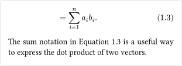

# equate
A package for improved layout of equations and mathematical expressions.

When applied, this package will split up multi-line block equations into multiple elements, so that each line can be assigned a separate number. By default, the equation counter is incremented for each line, but this behavior can be changed by setting the `sub-numbering` argument to `true`. In this case, the equation counter will only be incremented once for the entire block, and each line will be assigned a sub-number like `1a`, `2.1`, or similar, depending on the set equation numbering. You can also set the `number-mode` argument to `"label"` to only number labelled lines. If a label is only applied to the full equation, all lines will be numbered.

This splitting also makes it possible to spread equations over page boundaries while keeping alignment in place, which can be useful for long derivations or proofs. This can be configured by the `breakable` parameter of the `equate` function, or by setting the `breakable` parameter of `block` for equations via a show-set rule. Additionally, the alignment of the equation number is improved, so that it always matches the baseline of the equation.

If you want to create a "standard" equation with a single equation number centered across all lines, you can attach the `<equate:revoke>` label to the equation. This will disable the effect of this package for the current equation. This label can also be used in single lines of an equation to disable numbering for that line only.

## Usage
The package comes with a single `equate` function that is supposed to be used as a template. It takes two optional arguments for customization:

| Argument        | Type                | Description                                                | Default  |
| --------------- | ------------------- | ---------------------------------------------------------- | -------- |
| `breakable`     | `boolean`, `auto`   | Whether to allow the equation to break across pages.       | `auto`   |
| `sub-numbering` | `boolean`           | Whether to assign sub-numbers to each line of an equation. | `false`  |
| `number-mode`   | `"line"`, `"label"` | Whether to number all lines or only those with a label.    | `"line"` |

To reference a specific line of an equation, include the label at the end of the line, like in the following example:

```typ
#import "@preview/equate:0.2.1": equate

#show: equate.with(breakable: true, sub-numbering: true)
#set math.equation(numbering: "(1.1)")

The dot product of two vectors $arrow(a)$ and $arrow(b)$ can
be calculated as shown in @dot-product.

$
  angle.l a, b angle.r &= arrow(a) dot arrow(b) \
                       &= a_1 b_1 + a_2 b_2 + ... a_n b_n \
                       &= sum_(i=1)^n a_i b_i. #<sum>
$ <dot-product>

The sum notation in @sum is a useful way to express the dot
product of two vectors.
```

  


### Shared Alignment Blocks
If you want to interrupt a multi-line equation with text or other elements, you can use the `share-align` function to create a shared alignment block. This will ensure that all block equations within that block (that don't have the `<equate:revoke>` label) share their alignment points.

### Local Usage
If you only want to use the package features on selected equations, you can also apply the `equate` function directly to the equation. This will override the default behavior for the current equation only. Note, that this will require you to use the `equate` function as a show rule for references, as shown in the following example:

```typ
#import "@preview/equate:0.2.1": equate

// Allow references to a line of the equation.
#show ref: equate

#set math.equation(numbering: "(1.1)", supplement: "Eq.")

#equate($
  E &= m c^2 #<short> \
    &= sqrt(p^2 c^2 + m^2 c^4) #<long>
$)

While @short is the famous equation by Einstein, @long is a
more general form of the energy-momentum relation.
```


As an alternative to the show rule, it is also possible to manually wrap each reference in an `equate` function, though this is less convenient and more prone to mistakes.
